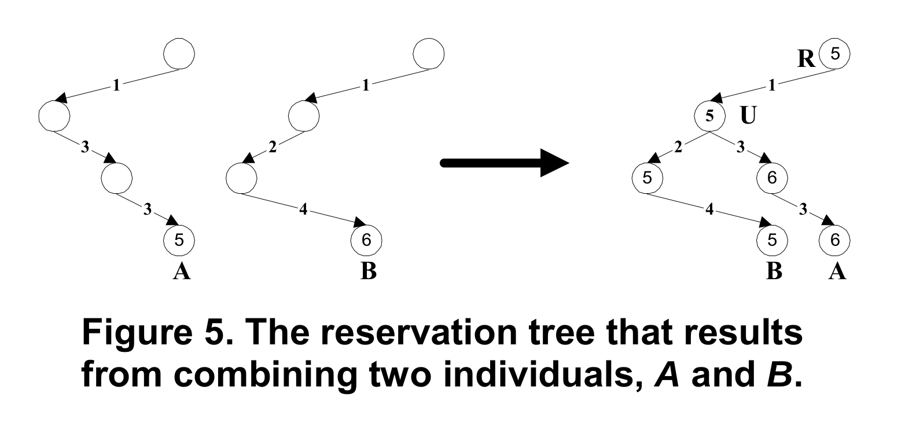
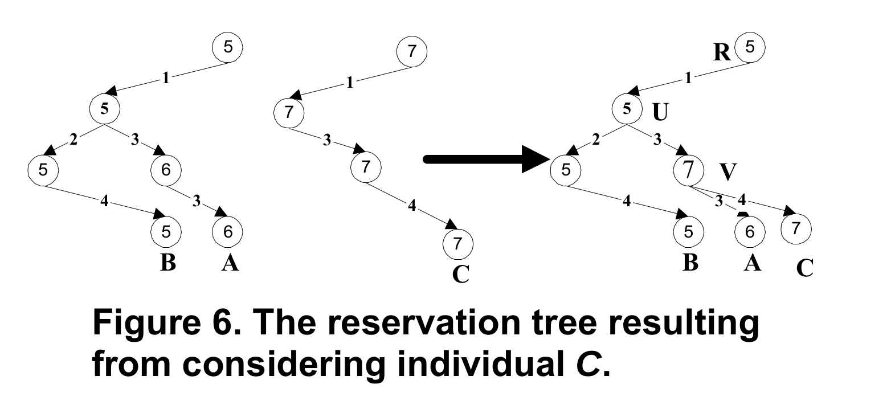

# **QUARTO**

During the development of this project I used 2 approaches:

- Monte Carlo Tree Search (MCTS, developed in collaboration with Riccardo Musumarra s295103. However, we have completely different implementations)

- Genetic Minimax (developed entirely by myself)

The MCTS agent performs far better than the Genetic MiniMax one. If there should be chosen only one for the evaluation of my project, that should be MCTS. However, I thought to include my work on Genetic Minimax too, since I think it is an interesting idea.

## Common characteristics between the two agents

### State representation

A state in Quarto is represented by a tuple of board state (i.e. a 4x4 matrix telling which pieces are on the board on which position) and the piece chosen by a player to be played by the opponent.

(boardState, chosenPiece)

### Move (ply) of a player

A move (ply) is represented by two actions performed in this order:

1. Place the piece chosen by the opponent in the previous move on the board on one of the available spots.
2. Choose a piece that must be used by the opponent

The player that must do the first move will skip action 1, since there is no piece previously chosen, so it will only pick the piece for its opponent.

(position, pieceForNextMove)

## **GENETIC MINMAX**

I took this idea from [this](https://www.researchgate.net/publication/3755904_A_genetic_minimax_game-playing_strategy) scientific paper.

As the name suggests, the approach combines 2 well known paradigms: Genetic Algorithm and Adversarial Search (MinMax).

The solution is based on a genetic algorithm, in which the offspring are put together with the population (note that the offspring are not introduced in the population until all the offspring have been generated) and then the best individuals among the current population plus the offspring are chosen for the next generation. In short, we are using ($\mu$ + $\lambda$) strategy.

### Individual

An individual is represented by a class with the same name. It has the following fields:

- genome
- leaf evaluation
- fitness

### Genome

A gene is a move describing the transition from one state of the game to another.

The genome of an individual is a sequence of genes (moves) describing all the moves (of both players) done throughout a match from the initial state to a terminal state.

### Leaf evaluation

It tells the outcome of a match described by the genome of the individual. It can have 3 values: 1 (genetic minmax agent won), -1 (genetic minmax agent lost) and 0 (draw).

### Fitness (Reservation Tree)

The fitness is calculated using something called "Reservation Tree". Here is where the similarity with MinMax starts. The reservation tree is a tree formed by overlapping the genomes of the individuals in a population to form a tree on which a MinMax-like algorithm is applied to compute the fitness.

Like in classical MinMax, evaluations at the leaf nodes are propagated upwards and at each level either the minimum values or the maximum values are chosen.

The fitness of an individual is a measure of how high up the reservation tree its leaf value propagates when performing MinMax. This measure is computed relative to the deepest point of the tree.

### Genetic operators

#### Mutation

Choose a random locus in the genome of an individual to be a point of mutation (POM). Everything before POM stays the same, i.e. keep the same game moves as the initial individual. From POM onwards, perform random moves until reaching a terminal state.

#### Recombination

Recombination does not make sense in this context. First of all, to obtain a new individual, the two individuals to be combined must have the same initial moves, otherwise the new individual could have moves in its genome corresponding to the same piece. Second, if we combine two individuals having the same first sequence of moves, we obtain a copy of one of the two, which is useless.

So, recombination is not used in this agent

### Parent selection

Based on tournament approach.

### Survival selection

The fittest $\mu$ individuals are selected for the population of the next generation.

### Results

- $POPULATION\_SIZE = 70$ and $OFFSPRING\_SIZE = 40$ and $NUM\_GENERATIONS = 10$
  - genetic_minmax_winrate = 60% (out of 10 matches) and 1 draw
  - genetic_minmax_winrate = 46.66% (out of 15 matches) and 0 draw

Unfortunately, the genetic minmax agent has very poor results when competing against the random player. Best it can do is to perform slightly better than the random player, at roughly around 55% winrate.

Also, the genetic minmax agent works very slowly.

## **MONTE CARLO TREE SEARCH**

During the development of this agent, the classical Monte Carlo Tree Search algorithm (MCTS) was used.

### Some words on UCB

$$ UCB1(S_i) = \overline{w_i} + C \times \sqrt{\log(N) \over n_i} $$

where:

- $S_i =$ child state
- $\overline{w_i} =$ winrate of child state
- $C =$ temperature
- $N =$  nr. of visits of the parent state
- $n_i$ = nr. of visits of the child state

UCB is used for choosing the child node during tree traversal.

The the temperature value $C$ serves as defining a trade-off between exploration and exploitation. The higher $C$ is, the more the algorithm leans towards exploration.

MCTS algorithm consists of 4 stages:

1. Tree traversal
2. Node expansion
3. Rollout
4. Backpropagation

### Tree traversal

Starting from the root node, explore the tree. At the current state, the algorithm checks if the current state is:

- a terminal state
- a leaf node that has never been visited
- a leaf node that has been visited before

If it's none of the above, then the node is a "middle" node. If this is the case, the algorithm must go further with the tree traversal. To do so, it must choose one of its children, more specifically, it must choose the child with the highest UCB (Upper Confidence Bound) value and goes ahead recursively.

If the current node is a terminal state, then there is no need for rollout, and so it will assign either 1 (MCTS agent wins) or 0 (draw or MCTS agent loses)

In case of a never visited leaf node, a **rollout** is performed from here and at the end of the rollout, **backpropagation** is performed.

Finally, in case of a leaf node that has been visited before, the node is **expanded** and one of these newly generated children is chosen and a **rollout** is performed on it.

### Node expansion

Create a child node for each possible move that can be performed from the state represented by the node to be expanded.

### Rollout

From the given state, perform random moves until a terminal state is reached. Once such a state is reached, assign it either 1 (for winning) or 0 (for draw or losing).

### Backpropagation

Once a leaf node is reached and has been evaluated, update the nodes traversed according to this evaluation.

### Results

The MCTS agent performs much better then genetic minmax. Here are some results from running multiple simulations of multiple matches:

- $C=2$ and $MCTS\_ITER\_NUM = 100$:
  - mcts_winrate = 91% (out of 100 matches) and 1 draw
  - mcts_winrate = 87% (out of 100 matches) and 0 draws
  - mcts_winrate = 89% (out of 100 matches) and 0 draws

- $C=1$ and $MCTS\_ITER\_NUM = 100$:
  - mcts_winrate = 87% (out of 100 matches) and 0 draw
  - mcts_winrate = 80% (out of 100 matches) and 1 draw
  - mcts_winrate = 85% (out of 100 matches) and 0 draw

- $C=2$ and $MCTS\_ITER\_NUM = 200$:
  - mcts_winrate = 97% (out of 100 matches) and 0 draw
  - mcts_winrate = 96% (out of 100 matches) and 0 draw
  - mcts_winrate = 94% (out of 100 matches) and 0 draw

As it can be noticed, having a high temperature value ($C=2$) and a high number of iterations of the MCTS algorithm ($200$) leads to very good results and performing a move doesn't take more than 3-4 seconds.

If execution speed is a concern, setting the iteration number to half still provides good results but at a much faster execution.
