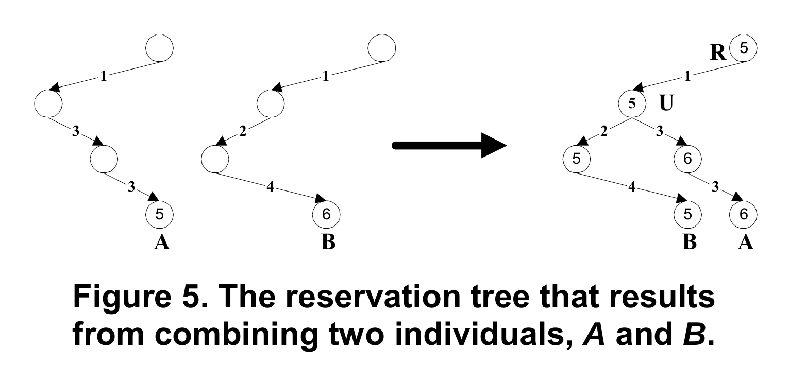
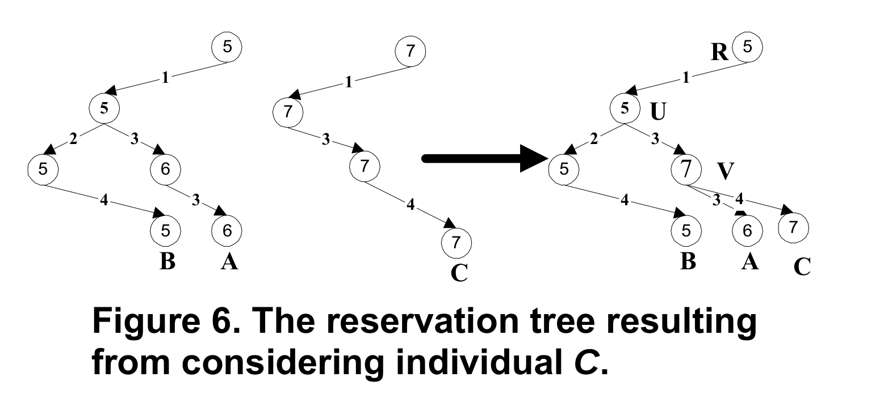

# COMPUTATIONAL INTELLIGENCE: course activity report

- student: ABED SERGIU MOHAMED (s295149)

This report summarizes my activity throughout the course. This report is split in 4 parts: lab activities, peer-reviews, the final project (Quarto) and an appendix with the codes provided.

## LAB ACTIVITIES

During the lab activities I worked together with Riccardo Musumarra (s295103) and Luca Balduzzi (s303326).

### **Lab 1: Set Covering**

#### **Task**

Given a number $N$ and some lists of integers $P = (L_0, L_1, L_2, ..., L_n)$,
determine, if possible, $S = (L_{s_0}, L_{s_1}, L_{s_2}, ..., L_{s_n})$
such that each number between $0$ and $N-1$ appears in at least one list

$$\forall n \in [0, N-1] \ \exists i : n \in L_{s_i}$$

and that the total numbers of elements in all $L_{s_i}$ is minimum.

#### **Approach**

The search function utilized is based on the general graph search algorithm, provided by the professor in his slides, and it is set as breadth-first with some optimizations.

#### **State**

A *State class* is used to store the necessary data. To explain its workings, let us consider an instance of it called *state*. It comprises a list of lists of integers called *state.solution* and a set of integers called *state.cover*. The object *state.solution* is the actual state the tree search is based on: we want its lists to have minimal instersections among each others. The object *state.cover* represents the unique integers covered by *state.solution*; it is used to check if a state has reached the goal state, that is full coverage of the integers from 0 to N-1, to compute one the cost measures and to optimize the space of possible actions.
Once *state.solution* has reached the goal state, the goodness of the result is evaluated using the *weight*, the sum of the lengths of *state.solution* lists and the *bloat*, the relative difference between *weight* and the length of *state.cover*.

#### **Actions**

In this context, an "action" is the act of adding a list to the *state.solution*, forming a new state, and "discovering a node" means to add the new state to the frontier according to its computed priority.
Calculation the space of possible action is trivial, since it is only the set difference between the lists in *state.solution* and the collection of all lists.
Given that the size of the frontier become quickly unmanageable with $N > 30$, it is necessary to decrease the number of discovered nodes. To achieve this, we only select actions that actually increase the cover.
Unfortunately this is not effective enough, thus we performed a statistical discrimination based on the bloat. More precisely, we computed the bloat of all of the new states that resulted from adding each of the remaining lists from the previous step. Then we compute the average of such collection, and discarded all the actions the resulted in a greater than average bloat. This last selection, similar to a beam search, was quite effective in reducing memory utilization, even though deprives us the guarantee of completeness given by the breadth-first search.

#### **Node Cost**

The cost of an action is computed as the sum of two terms:

- a measure of impurity (repeated integers), the resuting size of the intersection between *state.cover* and the cover of the action, divided by the length of the action;

- a measure of simplicity (choosing longer lists to reach the goal state faster): the length of the action over N.

#### **Priority Function**

The priority function is simply the cost of the *new_state*.

#### **Results**

- N = 5, W = 5, Bloat: 0%, Visited Nodes = 3

- N = 10, W = 10, Bloat: 0%, Visited Nodes = 3

- N = 20, W = 23, Bloat: 15%, Visited Nodes = 449

- N = 50, W = 66, Bloat: 32%, Visited Nodes = 61898

- N = 100: not tried, given the increase of visited nodes for smaller N.

#### **Sources**

- Giovanni Squillero's Github Computational Intelligence

- 8 Puzzle Solution

- Giovanni Squillero's Slides of the course Computational Intelligence 2022/2023

### **Lab 2: Set Covering via Genetic Algorithm**

#### Task

Given a number $N$ and some lists of integers $P = (L_0, L_1, L_2, ..., L_n)$,
determine, if possible, $S = (L_{s_0}, L_{s_1}, L_{s_2}, ..., L_{s_n})$
such that each number between $0$ and $N-1$ appears in at least one list

$$\forall n \in [0, N-1] \ \exists i : n \in L_{s_i}$$

and that the total numbers of elements in all $L_{s_i}$ is minimum.

#### **Approach**

The solution is based on a genetic algorithm using strategy 2 (as called by the professor in the slides), in which the offspring are put together with the population (note that the offspring are not introduced in the population until all the offspring have been generated) and then the best individuals among the current population plus the offspring are chosen for the next generation. In short, we are using ($\mu$ + $\lambda$) strategy.

An offspring is generated by one of the two genetic operators: mutation and recombination.

#### **Terminology**

- gene = list in the list of lists generated by "problem()"
- genome = list of genes
- individual = conceptually, it is a representation of a genome with some extra information (set of covered elements w/o repetitions, weight, fitness)
- weight = nr of elements covered by considering the repetitions
- fittness = -weight
- locus = index within a genome
- allele = a possible gene that can occupy a certain locus

#### Parent selection

Based on tournament approach. Here, we used tournaments of size 2 and 20. As explained in class, the higher tournament size, the higher selective pressure.

#### Genetic operators

##### **Mutation**

Randomly select a locus within the genome of the individual to be mutated and an allele to replace the gene on that locus.
The mutation function implemented here may produce individuals that are not solutions to the Set Covering problem. They are discarded during the execution of the evolution function.

##### **Recombination**

It takes as input two parents, splits their genomes and combines them to form a new individual.
As with mutation, the individuals that are not solutions are discarded during evolution.

#### **Fitness**

We considered fitness to be minus the weight, so the smaller is the weight of an individual, the fitter it is.

#### **Survival selection**

The fittest $\mu$ individuals are selected for the population of the next generation.

#### **Generation**

Offspring are generated either through mutation or recombination. The choice is done randomly. The parents are chosen through tournaments.
Once the parents and the genetic operator are chosen, the operator is applied on the parent(s) until a correct solution is produced.
Once the offspring generation is over, they are put in the population and survival selection is performed.

#### **Results**

For tournament size 2:

- N = 5, W = 5

- N = 10, W = 10

- N = 20, W = 24

- N = 50, W = 83

- N = 100, W = 207

- N = 500, W = 1625

- N = 1000, W = 3693

- N = 5000, W = 25516

For tournament size 20:

- N = 5, W = 5

- N = 10, W = 10

- N = 20, W = 27

- N = 50, W = 72

- N = 100, W = 191

- N = 500, W = 1481

- N = 1000, W = 3519

- N = 5000, W = 23338

##### Sources

- Giovanni Squillero's Github Computational Intelligence

- one-max.ipynb

- Giovanni Squillero's Slides of the course Computational Intelligence 2022/2023

### **Lab 3: Policy Search**

#### Info for the Reader

Main files on which the code has been developed:

- nim_utils.py
- evolution.py
- minmax.py
- reinforcement_learning.py
- test_evolution.py (run this script to see results of task 3.2)
- test_minmax.py (run this script to see results of task 3.3)
- test_reinforcement.py (run this script to see results of task 3.4)

#### **Task**

See problem description [here](https://github.com/squillero/computational-intelligence/blob/master/2022-23/lab3_nim.ipynb).

#### **Task 3.1: An agent using fixed rules based on nim-sum (i.e., an expert system)**

Provided by professor in the link above. (see "pure-random" and "optimal_strategy")

#### **Task 3.2: An agent using evolved rules**

##### **Approach**

The solution is based on a genetic algorithm using strategy 2 (as called by the professor in the slides), in which the offspring are put together with the population (note that the offspring are not introduced in the population until all the offspring have been generated) and then the best individuals among the current population plus the offspring are chosen for the next generation. In short, we are using ($\mu$ + $\lambda$) strategy.

An offspring is generated by one of the two genetic operators: mutation and recombination.

In this solution, 4 hard-coded rules are used for building the agents. An agent differs from another by the probabolity with which it will use a certain hard-coded rule.

The following are the hard-coded rules:

- pure-random: choose any possible move randomly and perform it (provided by the professor)

- greedy_pick: this rule assumes that every time the opponent makes a move, it will always take all the elements in a row, leaving it empty. In such a (very unlikely) situation, the player will also pick all the elements in a row ONLY IF there are n odd nr of active rows left. Otherwise, it will leave only one element in the row, hoping that the opponent will empty that row (or any other) so that the nr of rows is odd.

- even_odd: pick a random row and remove from it an odd random nr of elements from it if the index of the row is odd. Otherwise, remove an even random nr of elements

- shy_pick: always pick only one object from a random row

##### **Terminology**

- gene = probability of a rule to be used for performing a ply
- genome = tuple of genes. It's described by the named tuple "Genome"
- individual = in this case, it's the same thing as a genome
- fittness = percentage of matches won against an opponent using just fixed rules (e.g. pure_random or optimal_strategy)
- locus = index within a genome

##### **Parent selection**

Based on tournament approach. Here, we used tournaments of size 20. As explained in class, the higher tournament size, the higher selective pressure.

##### **Genetic operators**

###### **Mutation**

Randomly select a locus within the genome of the individual to be mutated and an allele (i.e. new probability) to replace the gene on that locus.

###### **Recombination**

It takes as input two parents, splits their genomes and combines them to form a new individual.

##### **Fitness**

We considered the fitness to be the percentage of matches (out of NUM_MATCHES) won against an opponent using just fixed rules (e.g. pure_random or optimal_strategy).

note: in order to obtain consistent fitness results, the hyperparameter NUM_MATCHES must be large (here it was set to 100). Otherwise, computing the fitness on the same individual multiple times will give very different results. Also, due to the large NUM_MATCHES value, the execution of the code is quite slow (~ 7min)

##### **Survival selection**

The fittest $\mu$ individuals are selected for the population of the next generation.

##### **Generation**

Offspring are generated either through mutation or recombination. The choice is done randomly. The parents are chosen through tournaments.
Once the parents and the genetic operator are chosen, the operator is applied on the parent(s).
Once the offspring generation is over, they are put in the population and survival selection is performed.

##### **Results**

Results obtained setting the hyperparameters:
NUM_MATCHES = 100
NIM_SIZE = 10
POPULATION_SIZE = 10
OFFSPRING = 5
GENERATIONS = 10

Opponent: pure_random

Running the code multiple times, the following solutions were found:

- Genome(pure_random_p=0.15174121646190042, greedy_p=0.6540699798440321, even_odd_p=0.02427360046175844, shy_pick=0.16991520323230905)
  - win rate: 0.83

- Genome(pure_random_p=0.08799303781985655, greedy_p=0.5976836230147908, even_odd_p=0.17676669405262752, shy_pick=0.13755664511272517)
  - win rate: 0.8

- Genome(pure_random_p=0.11361286340732811, greedy_p=0.6506918540601518, even_odd_p=0.18591195830290055, shy_pick=0.04978332422961946)
  - win rate: 0.81

#### **Task 3.3: An agent using minmax**

Just a classical implementation of the *minmax decision rule*. A game tree is generated enumerating each possible move in every ply, with a depth limited by a look ahead option. A **heuristic function** evaluates a node based on whether its nim-sum is zero or not, or whether it represents a positive or negative critical situation (where the nim-sum strategy fails to determine the best action). The *minmax strategy* wins against a random one competes against a nim-sum opponent, but only for a look-ahead of 1 ply. This is probably due to the **horizon effect**.

#### **Task 3.4 Reinforcement Learning**

A **temporal difference tabular Q-learning** implementation that competes at the same level against a *nim-sum strategy* opponent. Being a tabular method, it does not scale well when increasing the number of heaps. Reward are **positives** for the action leading to a victory, **negative** for the action causing a defeat and **zero** for all the others. *Exploration* is regulated by setting the probability of choosing the less frequent action instead of the greedy one.

#### **Sources**

- Giovanni Squillero's Github Computational Intelligence

- one-max.ipynb

- lab3_nim.ipynb

- Giovanni Squillero's Slides of the course Computational Intelligence 2022/2023

## Peer reviews

### Peer reviews I wrote

#### Lab1

- [lucavillanigit](https://github.com/lucavillanigit/Computational_Intelligence/issues/1)

> **Review by Sergiu Abed**
>
>*I executed the code with both `unit_cost = lambda a: 1` and `unit_cost = lambda a: len(a)` and in the former case a solution was found by visiting very few states with the drawback of obtaining solutions far from the optimal one. In the latter case, the program was able to find optimal solutions for `N = 5, 10, 20`, but at the cost of visiting a large number of states (I was getting around 447,263 visited nodes for `N = 20`).*
>
>*I would say this is a good algorithm, giving you the choice to choose between the two cases, depending on whether you value more the optimality of the solution or the time and space costs.*
>
>**Pros**
>
>- *having `unit_cost = lambda a: len(a)` seems to lead to the optimal solution for `N=5, 10, 20`*
>- *the heuristic function reduces drastically the number of visited nodes in both weighted and unweighted situations*
>
>**Cons**
>
>- *a brief description in `README` of how the code works would have been useful*
>- *having `priority_function` defined at line 44 and then using a different function (the lambda function passed as argument at line 142) can lead to confusions. I spent an hour trying to understand how changing the `unit_cost` improved the results when "priority_function" at line 44 was not using the `state_cost` dictionary at all.*
>
>**note:** *I noticed that you named the directory `Lab1` and the professor told us on telegram that the directory of the program should be named `lab1`. Make sure that the link of your repository is written in `lab1.txt` file shared on the telegram group.*
>

- [AlessiaLeclercq](https://github.com/AlessiaLeclercq/ComputationalIntelligence_S291871/issues/4)

>**Review by Sergiu Abed**
>
>*There is nothing to complain about in this project. The program is well written, organized in a clean way and the comments on each function and class definition made it easy to understand what everything is doing.*
>
>*In terms of performance, all the approaches seem to find a solution in a relatively (i.e. compared to other solutions I've seen) low number of visited nodes. The heuristic function added to the Dijkstra approach (here named Breadth First) to form the A\* strategy does a good job in both finding the optimal solution and reducing the number of visited nodes.*

#### Lab2

- [LorenzoRadaele](https://github.com/LorenzoRadaele/Computational-Intelligence/issues/3)

>**Lab2 review**
>
>*After looking and running your code multiple times I can say that overall the program is very well done.*
>
>**Pros**
>
>- *clear, organized code which helped in understanding the flow of the algorithm implemented*
>- *good decision to implement a mutation function that modifies more than one gene of an individual. This helps in making the mutation operation more impactful in helping to find the more optimum solution*
>- *the algorithm gives comparable results with the good results reported by the other students in the telegram chat*
>
>**Cons**
>
>- *code is quite slow*
>
>**suggestion**
>
>*You could try to initialize the population with individuals that already have full coverage (this is the approach me and my teammates used). You can generate them randomly and mutate and recombine them to get offspring and discard offspring that do not have full coverage.*

- jandvanegas

>**Lab2 review**
>
>*If i understood correctly, the goal of this program is to start from a "primitive" generation and throughout many generations a solution will evolve and the direction of the evolution is determined by the number of unique numbers in the genome of individuals (which serves as the fitness).*
>
>*This is an interesting approach to the problem, however, the program stops at the first generated solution to the set-covering problem, i.e. it is not looking for optima.*
>
>*You could try to initialize the population with individuals with more than one gene (i.e. with more then one list) and modify the fitness so that individuals with full coverage are considered the fittest and add a penalty in the fitness to the individuals that are not solutions (i.e. don't provide full-coverage)*
>
>**Pros**
>
>- *well and clearly written code. You can tell the proficiency in python of the author*
>
>**Cons**
>
>- *the program stops at the first found solution. With some modifications, the program can be able to look for multiple solutions and pick the more optimal one*

#### Lab3

- [AleTola](https://github.com/AleTola/Computational_Intelligence/issues/8)

>**Lab3 review**
>
>*I looked through your code and overall I must say that you did a good job.*
>
>**Evolution**
>
>*I like the idea of using probability as genome. I started from the same idea. My teammates took a different approach, but I decided to keep my version.*
>
>*One issue that I found in your implementation is that you're missing the crossover genetic operation, which I understand that it's because you used a single gene (the probability) as a genome so it's not really clear how you could implement crossover in this case.*
>
>*What you could do (this is what I did) is to use all 5 strategies during a match, each with a certain probability to be used. So the genome would be a list of 10 probabilities: 5 probabilities of using strategy 'x' to perform a ply and 5 probabilities corresponding to the inputs of each strategy. This way you can exploit all the strategies together and also implement crossover.*
>
>**Minmax**
>
>*Well done! Nothing bad to say about it. Alpha-beta pruning plus the depth limit are nice additions. The agent is able to give good results against a random opponent without having to visit all possible states.*
>
>**Reinforcement learning**
>
>*No comments here. Good job!*

- [FabioSofer]()

>**Lab3 review:**
>
>*I couldn't find any issues regarding your work. Good job!*
>
>**Evolutionary:**
>
>*Really great work! I'm really impressed by how little code you wrote and by how good your results are. This shows how smart your approach is.
>My solution involves a lot of steps and I'm only getting around 80% win rate against pure_random. You have my respect!*
>
>**Minmax:**
>*Again, great job here too! It's really impressive that you managed to obtain an agent playing as good as the optimal strategy. I noticed that in order to make your strategy win every time, you make your strategy start either first or second depending on the initial state. This is a bit unfair with respect to poor optimal_strategy player (I'm kidding hahah). I suppose there is no other way to make sure you always win against the optimal strategy.*
>
>**Reinforcement learning**
>
>*No comment. Great work!*

### Peer reviews I received

#### Lab1

- [ricanicida](https://github.com/sergiuabed/computational-intelligence-22/issues/1)

>**Review by Ricardo Nicida Kazama**
>
>**Questions/issues:**
>
>- *Have you considered using the new elements introduced by a node for the second term of the cost, instead of the measure of simplicity? In this, way you might also reach the goal state faster because you will maximize the number of new elements.* 
>- *Also for the measure of simplicity, for bigger values of N, doesn't the significance of this cost become irrelevant? (e.g. N = 100, given node x that has 10 repeated numbers and a total length of 50 will have the respective costs of 10 and 0.5, total cost = 9.5, which in my view could be an excellent candidate node and should have a lower cost)*
>
>**Overall:**
>- *Clean and organized code*
>- *Concise explanation of the problem and solution*
>- *Simple and effective approach to the problem*

#### Lab3

- [shadow036](https://github.com/sergiuabed/computational-intelligence-22/issues/2)

>*Hello, I'm gonna write my thoughts on your group's implementation of the third lab.*
>*As you will see, my advices are more about the computational optimization side rather than the actual problem representation.*
>
>**Evolutionary strategy**
>- *Lines 13 and 20 can be collapsed in a single line before the condition*
>- *Same for line 14 and 28*
>- *From here, further optimizations can lead to the following code:*
>
>```python
>      def greedy_pick(state):
>            is_odd = bool(cook_status(state)["active_rows_number"] % 2)
>            index_val2 = [(i,v) for i, v in index_val if v > 1]
>            flag = is_odd or len(index_val2) == 0
>            if flag:
>                index_val = [(i,v) for i, v in enumerate(state.rows) if v != 0]  # discards empty rows
>                indx = random.choice([i for (i, _) in index_val])
>            else:
>                indx = random.choice([i for (i,_) in index_val2])
>            return Nimply(indx, state.rows[indx] - int(not flag))
>```
>
>- *Can collapse row 48 and 56 (can also put the Nimply class call in the final return statement)*
>- *You can decrease the value of "objPicked" in line 46 only if it is larger than state.rows[row_i]. This can be done in 1 row by using the min function and tresholding at state_rows[row_i]*
>
>```python
>      def even_odd(state):
>          row_i = random.choice([i for i, v in enumerate(state.rows) if v!=0])
>          if row_i % 2:
>              objPicked = min(2*random.randint(0, state.rows[row_i]//2)+1, state.rows[row_i])
>          else:
>              objPicked = (2*random.randint(1, state.rows[row_i]//2) if state.rows[row_i] > 1 else 1)
>          return Nimply(row_i, objPicked)
>```
>
>- *In line 112 I believe you can use the numpy.random.choice function in order to avoid obtain a single random number without the need of popping the only element of the list*
>- *In line 133 the "offspring" variable is unused as well as the "o" variable in line 135.*
>- *I think it would have been better if you made the strategies compete against each other instead of comparing them against the pure random strategy and then taking the ones with highest winrate.*
>- *You need to make sure that the parents chosen for recombinations are not the same otherwise you'll end up with a clone.*
>- *Finally you would be able to spare one additional line by replacing the block from line 134 to line 144 with this one:*
>
>```python
>      for i in range(OFFSPRING):
>          p = tournament(population)            
>          if random.random() < 0.3:
>              o = mutation(p)
>          else:
>              p2 = tournament(population)
>              o = recombination(p, p2)
>          offspring.append(o)
>```
>
>*Apart from all these very small and almost insignificant issues, concerning the idea behind this strategy, I must say that I really like the idea of generating individuals containing different probabilities of applying a certain strategy in each given turn.*
>
>**min-max strategy**
>
>- *You can speed up the computation by taking advantage of the Python features and replacing the body of the  "print_match_result" with*
>
>```python
>      n_A_min = sum([1 for a in res if a[0] == A.name])
>      print(f"{A.name} won {n_A_win} times\n{B.name} won {len(res) - n_A_win} times")
>```
>
>- *In the "random_strategy" function you can shrink the code a little bit by compacting the last 5 lines in this way:*
>
>```python
>      heaps.numming(idx_heap, 1 if decrement else random.randint(1, heaps.rows[idx_heap]), player)
>```
>
>- *A further optimization in the "nim_sum" function would be using the "functools" module and replacing the whole body with:*
>
>```python
>      return reduce(lambda v1, v2: v1 ^ v2, l)
>```
>
>- *Also in the "minmax" function you could optimize the code in this way*:
>
>```python
>      node.value = (2 * int(maximising) - 1) * float('inf')
>      if depth == 0:
>          if sum(node.state) != 0:
>              node.value = heuristic(node, hash_table)
>          return node.value
>      node.value = (1 - 2 * int(maximising)) * node.value
>      for c in node.children:
>              node.value = (max if maximizing else min)(node.value, minmax(c, depth-1, not miximising, hash_table))
>      return node.value
>```
>
>- *A possible optimization concerning memory occupation during the execution of the code would be to use another hash table in order to map the tree nodes with the hash table entry or by using another mechanism to check if the current node has already been created. In this way you could have avoided to store all possible duplicate nodes and the algorithm would have been efficient even for an higher number of heaps without resorting to a lookahead table (I speak for experience as I unsuccessfully tried to implement a memory-reduction hash table myself).*
>
>*In this strategy I really liked the use of a look-ahead table in order to ease to computational complexity of the algorithm and in this way also avoiding the computation of the full tree from the beginning.*
>
>**reinforcement learning strategy**
>
>*No issues fwere ound in this part other than the fact that the assert in line 50 is not strictly necessary and that the value returned by the "generate_actions" function is never used.*

## **QUARTO**

During the development of this project I used 2 approaches:

- Monte Carlo Tree Search (MCTS, developed in collaboration with Riccardo Musumarra s295103. However, we have completely different implementations)

- Genetic Minimax (developed entirely by myself)

The MCTS agent performs far better than the Genetic MiniMax one. If there should be chosen only one for the evaluation of my project, that should be MCTS. However, I thought to include my work on Genetic Minimax too, since I think it is an interesting idea.

### Common characteristics between the two agents

#### State representation

A state in Quarto is represented by a tuple of board state (i.e. a 4x4 matrix telling which pieces are on the board on which position) and the piece chosen by a player to be played by the opponent.

(boardState, chosenPiece)

#### Move (ply) of a player

A move (ply) is represented by two actions performed in this order:

1. Place the piece chosen by the opponent in the previous move on the board on one of the available spots.
2. Choose a piece that must be used by the opponent

The player that must do the first move will skip action 1, since there is no piece previously chosen, so it will only pick the piece for its opponent.

(position, pieceForNextMove)

### **GENETIC MINMAX**

I took this idea from [this](https://www.researchgate.net/publication/3755904_A_genetic_minimax_game-playing_strategy) scientific paper.

As the name suggests, the approach combines 2 well known paradigms: Genetic Algorithm and Adversarial Search (MinMax).

The solution is based on a genetic algorithm, in which the offspring are put together with the population (note that the offspring are not introduced in the population until all the offspring have been generated) and then the best individuals among the current population plus the offspring are chosen for the next generation. In short, we are using ($\mu$ + $\lambda$) strategy.

#### Individual

An individual is represented by a class with the same name. It has the following fields:

- genome
- leaf evaluation
- fitness

#### Genome

A gene is a move describing the transition from one state of the game to another.

The genome of an individual is a sequence of genes (moves) describing all the moves (of both players) done throughout a match from the initial state to a terminal state.

#### Leaf evaluation

It tells the outcome of a match described by the genome of the individual. It can have 3 values: 1 (genetic minmax agent won), -1 (genetic minmax agent lost) and 0 (draw).

#### Fitness (Reservation Tree)

The fitness is calculated using something called "Reservation Tree". Here is where the similarity with MinMax starts. The reservation tree is a tree formed by overlapping the genomes of the individuals in a population to form a tree on which a MinMax-like algorithm is applied to compute the fitness.




Like in classical MinMax, evaluations at the leaf nodes are propagated upwards and at each level either the minimum values or the maximum values are chosen.

The fitness of an individual is a measure of how high up the reservation tree its leaf value propagates when performing MinMax. This measure is computed relative to the deepest point of the tree.

#### Genetic operators

##### Mutation

Choose a random locus in the genome of an individual to be a point of mutation (POM). Everything before POM stays the same, i.e. keep the same game moves as the initial individual. From POM onwards, perform random moves until reaching a terminal state.

##### Recombination

Recombination does not make sense in this context. First of all, to obtain a new individual, the two individuals to be combined must have the same initial moves, otherwise the new individual could have moves in its genome corresponding to the same piece. Second, if we combine two individuals having the same first sequence of moves, we obtain a copy of one of the two, which is useless.

So, recombination is not used in this agent

#### Parent selection

Based on tournament approach.

#### Survival selection

The fittest $\mu$ individuals are selected for the population of the next generation.

#### Results

- $POPULATION\_SIZE = 70$ and $OFFSPRING\_SIZE = 40$ and $NUM\_GENERATIONS = 10$
  - genetic_minmax_winrate = 60% (out of 10 matches) and 1 draw
  - genetic_minmax_winrate = 46.66% (out of 15 matches) and 0 draw

Unfortunately, the genetic minmax agent has very poor results when competing against the random player. Best it can do is to perform slightly better than the random player, at roughly around 55% winrate.

Also, the genetic minmax agent works very slowly.

### **MONTE CARLO TREE SEARCH**

During the development of this agent, the classical Monte Carlo Tree Search algorithm (MCTS) was used.

#### Some words on UCB

$$ UCB1(S_i) = \overline{w_i} + C \times \sqrt{\log(N) \over n_i} $$

where:

- $S_i =$ child state
- $\overline{w_i} =$ winrate of child state
- $C =$ temperature
- $N =$  nr. of visits of the parent state
- $n_i$ = nr. of visits of the child state

UCB is used for choosing the child node during tree traversal.

The the temperature value $C$ serves as defining a trade-off between exploration and exploitation. The higher $C$ is, the more the algorithm leans towards exploration.

MCTS algorithm consists of 4 stages:

1. Tree traversal
2. Node expansion
3. Rollout
4. Backpropagation

#### Tree traversal

Starting from the root node, explore the tree. At the current state, the algorithm checks if the current state is:

- a terminal state
- a leaf node that has never been visited
- a leaf node that has been visited before

If it's none of the above, then the node is a "middle" node. If this is the case, the algorithm must go further with the tree traversal. To do so, it must choose one of its children, more specifically, it must choose the child with the highest UCB (Upper Confidence Bound) value and goes ahead recursively.

If the current node is a terminal state, then there is no need for rollout, and so it will assign either 1 (MCTS agent wins) or 0 (draw or MCTS agent loses)

In case of a never visited leaf node, a **rollout** is performed from here and at the end of the rollout, **backpropagation** is performed.

Finally, in case of a leaf node that has been visited before, the node is **expanded** and one of these newly generated children is chosen and a **rollout** is performed on it.

#### Node expansion

Create a child node for each possible move that can be performed from the state represented by the node to be expanded.

#### Rollout

From the given state, perform random moves until a terminal state is reached. Once such a state is reached, assign it either 1 (for winning) or 0 (for draw or losing).

#### Backpropagation

Once a leaf node is reached and has been evaluated, update the nodes traversed according to this evaluation.

#### Results

The MCTS agent performs much better then genetic minmax. Here are some results from running multiple simulations of multiple matches:

- $C=2$ and $MCTS\_ITER\_NUM = 100$:
  - mcts_winrate = 91% (out of 100 matches) and 1 draw
  - mcts_winrate = 87% (out of 100 matches) and 0 draws
  - mcts_winrate = 89% (out of 100 matches) and 0 draws

- $C=1$ and $MCTS\_ITER\_NUM = 100$:
  - mcts_winrate = 87% (out of 100 matches) and 0 draw
  - mcts_winrate = 80% (out of 100 matches) and 1 draw
  - mcts_winrate = 85% (out of 100 matches) and 0 draw

- $C=2$ and $MCTS\_ITER\_NUM = 200$:
  - mcts_winrate = 97% (out of 100 matches) and 0 draw
  - mcts_winrate = 96% (out of 100 matches) and 0 draw
  - mcts_winrate = 94% (out of 100 matches) and 0 draw

As it can be noticed, having a high temperature value ($C=2$) and a high number of iterations of the MCTS algorithm ($200$) leads to very good results and performing a move doesn't take more than 3-4 seconds.

If execution speed is a concern, setting the iteration number to half still provides good results but at a much faster execution.

## APPENDIX

Here are reported the codes for the labs and project.

### Lab1

- lab1.py

```python
import logging
import random
from gx_utils import *
import copy

def problem(N, seed=None):
    random.seed(seed)
    return [
        list(set(random.randint(0, N - 1) for n in range(random.randint(N // 5, N // 2))))
        for n in range(random.randint(N, N * 5))
    ]
    
class State:
    def __init__(self, sol:list):
        self._solution = sol
        self._set_cover()
    
    def _set_cover(self):
        self._cover = set()
        for l in self._solution:
            self._cover.update(l)
    
    def __hash__(self):
        return hash((bytes(self._cover), bytes(sum(sum(_) for _ in self._solution))))
    
    def __eq__(self, other):
        assert isinstance(self, type(other))
        s1 = self._solution.sort()
        s2 = other._solution.sort()
        return s1 == s2
     
    def __lt__(self, other):
        assert isinstance(self, type(other)) 
        return sum(sum(_) for _ in self._solution) < sum(sum(_) for _ in other._solution)
    
    def __str__(self):
        return str(self._solution)

    def __repr__(self):
        return repr(self._solution)     
     
    @property
    def solution(self):
        return self._solution
    
    @property
    def cover(self):
        return self._cover
    
    def copy_solution(self):
        return copy.deepcopy(self._solution)

    
def goal_test(state:State, n:int):
    return len(state.cover) == n

# does the set difference between act_list and state.solution
# compute the bloat of hypotetical new states and chooses the lists that
# if added, yield a lower than average bloat
def possible_actions(state:State, act_list:list):
    r = list() # remaining lists
    r_best = list() # best remaining  lists
    b = list() # bloats of hypotetical new states
    for l in act_list:
        if l not in state.solution and state.cover.union(l) > state.cover:
            r.append(l)
            b.append(bloat(state.solution + [l]))
    if len(b) > 0:
        avg_b = sum(b)/len(b)
        for i in range(len(b)):
            if b[i] <= avg_b:
                r_best.append(r[i])
    return r_best
    
def take_action(state:State, act:list):
    c = state.copy_solution()
    c.append(act)
    return State(c)

def bloat(sol:list):
    if len(sol) == 0:
        return 1
    cov = set()
    for s in sol:
        cov.update(s)
    m = sum(len(_) for _ in sol)
    n = len(cov)
    return (m-n)/n

# return the cardinality of the intersection between state._cover and action
def num_repeats(state:State, action:list):
    return len(state._cover.intersection(set(action)))
    
def search(N):
    frontier=PriorityQueue()
    cnt = 0
    state_cost = dict()
    
    all_lists = sorted(problem(N, seed=42), key=lambda a: len(a))
    state = State(list()) 
    state_cost[state] = 0
    
    while state is not None and not goal_test(state, N):
        cnt += 1
        if cnt % 1000 == 0:
            logging.debug(f"N = {N}\tVisited nodes = {cnt}")
        for a in possible_actions(state, all_lists):
            new_state = take_action(state, a)
			# the first term is a measure of the impurity (repeated integers) introduced by choosing action a
			# the second term is a measure of simplicity: if we choose longer lists, the goal state is reached faster, visiting less nodes
            cost = num_repeats(state, a)/len(a) - len(a)/N
            if new_state not in state_cost and new_state not in frontier:
                state_cost[new_state] = state_cost[state] + cost
                frontier.push(new_state, p=state_cost[new_state])
            # don't care to upgrade state_cost since the equal solutions have the same cover
        if frontier:
            state = frontier.pop()
        else:
            state = None
           
    solution = state.solution        

    logging.info(
        f"search solution for N={N}: w={sum(len(_) for _ in solution)} (bloat={(sum(len(_) for _ in solution)-N)/N*100:.0f}%)"
    )
    logging.info(f"Visited nodes = {cnt}")
    logging.debug(f"{solution}")

logging.getLogger().setLevel(logging.INFO)


if __name__ == "__main__":
	for N in [5, 10, 20]:#, 50]:
	    search(N)

    #%timeit search(20)
    
```

- gx_utils.py

```python
# Copyright  2022 Giovanni Squillero <squillero@polito.it>
# https://github.com/squillero/computational-intelligence
# Free for personal or classroom use; see 'LICENSE.md' for details.

import heapq
from collections import Counter


class PriorityQueue:
    """A basic Priority Queue with simple performance optimizations"""

    def __init__(self):
        self._data_heap = list()
        self._data_set = set()

    def __bool__(self):
        return bool(self._data_set)

    def __contains__(self, item):
        return item in self._data_set

    def push(self, item, p=None):
        assert item not in self, f"Duplicated element"
        if p is None:
            p = len(self._data_set)
        self._data_set.add(item)
        heapq.heappush(self._data_heap, (p, item))


    def pop(self):
        p, item = heapq.heappop(self._data_heap)
        self._data_set.remove(item)
        return item


class Multiset:
    """Multiset"""

    def __init__(self, init=None):
        self._data = Counter()
        if init:
            for item in init:
                self.add(item)

    def __contains__(self, item):
        return item in self._data and self._data[item] > 0

    def __getitem__(self, item):
        return self.count(item)

    def __iter__(self):
        return (i for i in sorted(self._data.keys()) for _ in range(self._data[i]))

    def __len__(self):
        return sum(self._data.values())

    def __copy__(self):
        t = Multiset()
        t._data = self._data.copy()
        return t

    def __str__(self):
        return f"M{{{', '.join(repr(i) for i in self)}}}"

    def __repr__(self):
        return str(self)

    def __or__(self, other: "Multiset"):
        tmp = Multiset()
        for i in set(self._data.keys()) | set(other._data.keys()):
            tmp.add(i, cnt=max(self[i], other[i]))
        return tmp

    def __and__(self, other: "Multiset"):
        return self.intersection(other)

    def __add__(self, other: "Multiset"):
        return self.union(other)

    def __sub__(self, other: "Multiset"):
        tmp = Multiset(self)
        for i, n in other._data.items():
            tmp.remove(i, cnt=n)
        return tmp

    def __eq__(self, other: "Multiset"):
        return list(self) == list(other)

    def __le__(self, other: "Multiset"):
        for i, n in self._data.items():
            if other.count(i) < n:
                return False
        return True

    def __lt__(self, other: "Multiset"):
        return self <= other and not self == other

    def __ge__(self, other: "Multiset"):
        return other <= self

    def __gt__(self, other: "Multiset"):
        return other < self

    def add(self, item, *, cnt=1):
        assert cnt >= 0, "Can't add a negative number of elements"
        if cnt > 0:
            self._data[item] += cnt

    def remove(self, item, *, cnt=1):
        assert item in self, f"Item not in collection"
        self._data[item] -= cnt
        if self._data[item] <= 0:
            del self._data[item]

    def count(self, item):
        return self._data[item] if item in self._data else 0

    def union(self, other: "Multiset"):
        t = Multiset(self)
        for i in other._data.keys():
            t.add(i, cnt=other[i])
        return t

    def intersection(self, other: "Multiset"):
        t = Multiset()
        for i in self._data.keys():
            t.add(i, cnt=min(self[i], other[i]))
        return t
```

### Lab2

- set_covering_genetic.py

```python
import random
import copy

def problem(N, seed=None):
    random.seed(seed)
    return [
        list(set(random.randint(0, N - 1) for n in range(random.randint(N // 5, N // 2))))
        for n in range(random.randint(N, N * 5))
    ]

class Individual:
    # gene = list in the list of lists generated by "problem()"
    # genome = list of genes
    # individual = conceptually, it is a representation of a genome with some extra information (set of covered elements w/o repetitions, weight)
    # weight = nr of elements covered by considering the repetitions
    # fittness = -weight

    def __init__(self, genome: list):
        self.genome = genome
        self.representation = set()
        self.weight = 0

        for t in genome:
            self.representation.update(set(t))
            self.weight += len(t)

        #self.fitness = self.weight - len(self.representation)
        self.fitness = -self.weight

    @property
    def genome_copy(self):
        return copy.deepcopy(self.genome)

n = 500
SEED = 42
POPULATION_SIZE = 1000
OFFSPRING = 10
GENERATIONS = 1000

alleles = problem(N=n, seed=SEED)

def check_solution(genome):     # used for producing the first "generation" of individuals in the population
    s = set()                   # used also for checking if a new individual produced by mutation or recombination is a solution
    for l in genome:
        s.update(set(l))

    solutionRepr = set(range(0, n))

    return s == solutionRepr

def initialize_population(alleles):
    population = []
    
    i = 0
    while i < POPULATION_SIZE:
        genome = []
        while not check_solution(genome):
            allele = alleles[random.randint(0, len(alleles)-1)]
            genome.append(allele)

        population.append(Individual(genome=genome))
        i+=1

    return population
    
def mutation(ind: Individual):
    genome = ind.genome_copy
    locus = random.randint(0, len(genome)-1)

    new_allele = alleles[random.randint(0, len(alleles)-1)]

    genome[locus] = new_allele

    return Individual(genome=genome)

def recombination(ind1: Individual, ind2: Individual):
    genome1 = ind1.genome_copy
    genome2 = ind2.genome_copy
    new_genome = []

    splitIndex = random.randint(0, min(len(genome1), len(genome2)))

    new_genome.extend(genome1[:splitIndex])
    new_genome.extend(genome2[splitIndex:])

    return Individual(new_genome)

def tournament(population, tournament_size=20):
    return max(random.choices(population=population, k=tournament_size), key=lambda i: i.fitness)

def evolution(population):
    offspring = []
    for g in range(GENERATIONS):
        offspring = []
        for i in range(OFFSPRING):
            o = Individual([])
            if random.random() < 0.3:
                while not check_solution(o.genome):
                    p = tournament(population)
                    o = mutation(p)
            else:
                while not check_solution(o.genome):
                    p1 = tournament(population)
                    p2 = tournament(population)
                    o = recombination(p1, p2)
            
            offspring.append(o)
        population += offspring
        population = sorted(population, key = lambda i: i.fitness, reverse = True)[:POPULATION_SIZE]

    return population[0]

if __name__ == '__main__':
    population = initialize_population(alleles)
    
    solution = evolution(population)
    print(f"n: {n}")
    print(f"weight: {solution.weight}")
    
    print(solution.representation)
```

### Lab3

- nim_utils.py

```python
from collections import namedtuple
from copy import deepcopy
from operator import xor
import random
from itertools import accumulate
from typing import Callable


Nimply = namedtuple("Nimply", "row, num_objects")

class Nim:
    def __init__(self, num_rows: int, k: int = None) -> None:
        self._rows = [i * 2 + 1 for i in range(num_rows)]
        self._k = k

    def __bool__(self):
        return sum(self._rows) > 0

    def __str__(self):
        return "<" + " ".join(str(_) for _ in self._rows) + ">"

    @property
    def rows(self) -> tuple:
        return tuple(self._rows)

    @property
    def k(self) -> int:
        return self._k

    def nimming(self, ply: Nimply) -> None:
        row, num_objects = ply
        assert self._rows[row] >= num_objects
        assert self._k is None or num_objects <= self._k
        self._rows[row] -= num_objects

# function used for "brute_force" (see "cook_status")
def nim_sum(state: Nim) -> int:
    *_, result = accumulate(state.rows, xor)
    return result

# cook_status returns a dict of rules used for evolving a solution
def cook_status(state: Nim) -> dict:
    cooked = dict()
    cooked["possible_moves"] = [
        (r, o) for r, c in enumerate(state.rows) for o in range(1, c + 1) if state.k is None or o <= state.k
    ]
    cooked["active_rows_number"] = sum(o > 0 for o in state.rows)
    cooked["shortest_row"] = min((x for x in enumerate(state.rows) if x[1] > 0), key=lambda y: y[1])[0]
    cooked["longest_row"] = max((x for x in enumerate(state.rows)), key=lambda y: y[1])[0]
    cooked["nim_sum"] = nim_sum(state)

    brute_force = list()
    for m in cooked["possible_moves"]:
        tmp = deepcopy(state)
        tmp.nimming(m)
        brute_force.append((m, nim_sum(tmp)))
    cooked["brute_force"] = brute_force

    return cooked

# working solutions given by the professor. "pure_random" is used for evolving a solution based on rules
def pure_random(state: Nim) -> Nimply:
    row = random.choice([r for r, c in enumerate(state.rows) if c > 0])
    num_objects = random.randint(1, state.rows[row])
    return Nimply(row, num_objects)

def optimal_startegy(state: Nim) -> Nimply:
   data = cook_status(state)
   return next((bf for bf in data["brute_force"] if bf[1] == 0), random.choice(data["brute_force"]))[0]

NUM_MATCHES = 100
NIM_SIZE = 10

def evaluate(strategy: Callable) -> float:
    opponent = (strategy, pure_random)
    won = 0

    for m in range(NUM_MATCHES):
        nim = Nim(NIM_SIZE)
        player = 0
        while nim:
            ply = opponent[player](nim)
            nim.nimming(ply)
            player = 1 - player
        if player == 1:
            won += 1
    return won / NUM_MATCHES
```

- evolution.py

```python
from nim_utils import *
from collections import namedtuple

def greedy_pick(state: Nim) -> Nimply: # (not to be confused with Greedy Nim, which is a variation of how the game is played)
    # this rule assumes that every time the opponent makes a move, it will always take all the elements in a row, leaving it empty
    # In such a (very unlikely) situation, the player will also pick all the elements in a row ONLY IF there are n odd nr of active rows left. Otherwise,
    # it will leave only one element in the row, hoping that the opponent will empty that row (or any other) so that the nr of rows is odd.

    # if you think this rule is silly, you're right.
    greedy_ply= None
    game_status = cook_status(state)
    if game_status["active_rows_number"] % 2: # nr of active rows is odd
        index_val = [(i,v) for i, v in enumerate(state.rows) if v != 0] # discards empty rows
        indx = random.choice([i for (i,_) in index_val])

        greedy_ply = Nimply(indx, state.rows[indx]) # empty the chosen row
        #state.nimming(ply=greedy_ply)
        
    else:
        index_val = [(i,v) for i, v in enumerate(state.rows) if v != 0] # discards empty rows
        index_val2 = [(i,v) for i, v in index_val if v>1] # discards rows with only 1 element

        if len(index_val2) != 0:
            indx = random.choice([i for (i,_) in index_val2])
            greedy_ply = Nimply(indx, state.rows[indx]-1) # leave only one element in the chosen row
            #state.nimming(ply=greedy_ply)
        else:   # i.e., all rows have only one element. In this case, pick a random row and empty it.
            indx = random.choice([i for (i,_) in index_val])
            greedy_ply = Nimply(indx, state.rows[indx]) # empty the chosen row
            #state.nimming(ply=greedy_ply)
    
    return greedy_ply


def even_odd(state: Nim) -> Nimply:
    # pick a random row and remove from it an odd random nr of elements from it if the index of the row is odd. Otherwise, remove an even random nr of elements
    # this rule is even sillier...

    index = [i for i, v in enumerate(state.rows) if v!=0]

    row_i = random.choice(index)
    ply = None
    if row_i % 2:
        objPicked = 2*random.randint(0, state.rows[row_i]//2)+1
        if not state.rows[row_i] % 2:  # if state.rows[row_i] is even, then the "+1" could result in objPicked > state.rows[row_i]
            objPicked-=1

        ply = Nimply(row_i, objPicked)
        #state.nimming(ply)
    else:
        if state.rows[row_i]==1:
            objPicked = 1   # if row_i is even and the value at this index 1, an even value <1 can't be picked (0 would mean skipping the move, which is not allowed)
                            # so, we make an exception to the rule: in case row_i even and state.rows[row_i]=1, always pick 1 element
        else:
            objPicked = 2*random.randint(1, state.rows[row_i]//2)
        ply = Nimply(row_i, objPicked)
        #state.nimming(ply)
    
    return ply

def shy_pick(state: Nim) -> Nimply:
    # always pick only one object from a random row
    index = [i for i, v in enumerate(state.rows) if v!=0]

    row_i = random.choice(index)
    ply = Nimply(row_i, 1)
    #state.nimming(ply)
    return ply

# list of rules
rules = [pure_random, greedy_pick, even_odd, shy_pick]

# defining how a genome of an individual is structured
# each entry (locus) in the genome corresponds to the probability (gene) of a rule being used as a ply made by the player
Genome = namedtuple("Genome", "pure_random_p, greedy_p, even_odd_p, shy_pick") # here, genes are the probabilities of the rules, not the rules themselves

def initialize_population(size) -> list:
    population = []
    i=0
    while i<size:
        g = Genome(random.randint(0, 10), random.randint(0, 10), random.randint(0, 10), random.randint(0, 10))
        g = Genome(*[x/sum(g) for x in g]) # computing the probabilities. They sum to 1.
        population.append(g)

        i+=1

    return population

def mutation(g: Genome) -> Genome:  # generate a new gene (probability) and place it in a random locus. Then, renormalize the genes, so that the probabilities sum up to 1
    locus = random.randint(0, len(g)-1)
    new_gene = random.uniform(0, 1)

    g_new = list(g)
    g_new[locus] = new_gene
    g_new = Genome(*[x/sum(g_new) for x in g_new])

    return g_new

def recombination(g1: Genome, g2: Genome) -> Genome:
    split = random.randint(1, len(g1)-1)    
    new_genome = Genome(*g1[:split], *g2[split:])
    new_genome = Genome(*[x/sum(new_genome) for x in new_genome])

    return new_genome

def sample_distribution(g: Genome) -> list:
    # defines a distribution based on the probabilities and samples it
    loci = [i for i in range(len(g))]
    sample = random.choices(loci, g, k=1)

    return sample.pop()     # sample is a list of 1 element, since "random.choices()" returns a list

def make_strategy(g: Genome) -> Callable:
    def strategy(state: Nim) -> Nimply:
        return rules[sample_distribution(g=g)](state)

    return strategy

def fitness(g: Genome) -> float:
    strategy = make_strategy(g=g)
    return evaluate(strategy=strategy)

def tournament(population, tournament_size=20):
    return max(random.choices(population=population, k=tournament_size), key=lambda i: fitness(i))

POPULATION_SIZE = 10
OFFSPRING = 5
GENERATIONS = 10

def evolution(population):
    offspring = []
    for g in range(GENERATIONS):
        offspring = []
        for i in range(OFFSPRING):
            o = None
            if random.random() < 0.3:
                p = tournament(population)
                o = mutation(p)
            else:
                p1 = tournament(population)
                p2 = tournament(population)
                o = recombination(p1, p2)
            
            offspring.append(o)
        population += offspring
        population = sorted(population, key = lambda i: fitness(i), reverse = True)[:POPULATION_SIZE]

    return population[0]
```

- minmax.py

```python
from typing import Callable
import copy
import random

N_HEAPS = 3
N_GAMES = 100

class Player:
    def __init__(self, name:str, strategy:Callable, *strategy_args):
        self._strategy = strategy
        self._strategy_args = strategy_args
        self._name = name
        self._loser = False
        self._n_plies = 0
    
    def ply(self, state):
        self._strategy(self, state, *self._strategy_args)
        self._n_plies += 1
    
    @property
    def loser(self):
        return self._loser
    
    @loser.setter
    def loser(self, val):
        self._loser = val
    
    @property
    def name(self):
        return self._name
    
    @property
    def n_plies(self):
        return self._n_plies
    
    @n_plies.setter
    def n_plies(self, val):
        self._n_plies = val
    
    def flush_parameters(self):
        self._n_plies = 0
        self._loser = False

class Nim:
    def __init__(self, num_rows: int=None, rows:list=None, k: int = None) -> None:
        if num_rows is not None:
            self._rows = [i*2 + 1 for i in range(num_rows)]
        else:
            self._rows = rows
        self._k = k

    def nimming(self, row: int, num_objects: int, player:Player) -> None:
        assert self._rows[row] >= num_objects
        assert self._k is None or num_objects <= self._k
        self._rows[row] -= num_objects
        if sum(self._rows) == 0:
            player.loser = True
    
    @property
    def rows(self):
        return self._rows
    
    def copy(self):
        return copy.deepcopy(self)
    
    


def play(A:Player, B:Player, state:Nim) -> Player:
    while not (A.loser or B.loser):
        A.ply(state)
        if not A.loser:
            B.ply(state)
    if A.loser:
        return B
    elif B.loser:
        return A

def match(A:Player, B:Player, state:Nim, n_games:int=1):
    winners = list()
    for i in range(n_games):
        initial_state = state.copy()
        A.flush_parameters()
        B.flush_parameters()
        r = random.random()
        if r <= 0.5:
            w = play(A, B, initial_state)
        else:
            w = play(B, A, initial_state)
        winners.append((w.name, w.n_plies))
    return winners

def print_match_result(A:Player, B:Player, res:list):
    n_A_win = 0
    n_games = len(res)
    for i in range(n_games):
        if res[i][0] == A.name:
            n_A_win += 1
    print(f"{A.name} won {n_A_win} times\n{B.name} won {n_games - n_A_win} times") 
    
def random_strategy(player:Player, heaps:Nim, decrement:bool=False):
    non_zero_heaps_idxs = [i for i, v in enumerate(heaps.rows) if v > 0] # choose a random non-zero heap
    idx_heap = random.choice(non_zero_heaps_idxs)
    if decrement:
        quantity = 1
    else:
        quantity = random.randint(1, heaps.rows[idx_heap]) # decrease it of a random quantity
    heaps.nimming(idx_heap, quantity, player)


class GameNode:
    def __init__(self, state: list, parent=None, children: list = None):
        self._state = state
        self._parent = parent
        self._children = children
        self._value = 0

    def __hash__(self):
        return hash(bytes(self._state))

    @property
    def value(self):
        return self._value

    @value.setter
    def value(self, val):
        self._value = val

    @property
    def parent(self):
        return self._parent

    @parent.setter
    def parent(self, val):
        self._parent = val

    @property
    def children(self):
        return self._children

    def add_child(self, child):
        self._children.append(child)

    @property
    def state(self):
        return self._state

def check_critical_situations(heaps: list) -> int:
    n_heaps = len(heaps)
    n_heaps_to_zero = len([i for i, h in enumerate(heaps) if h == 0])
    n_heaps_to_one = len([i for i, h in enumerate(heaps) if h == 1])
    n_heaps_greater_than_zero = n_heaps - n_heaps_to_zero
    n_heaps_greater_than_one = n_heaps_greater_than_zero - n_heaps_to_one

    # [1, a, 1, 1, 0, 0], a > 1
    if n_heaps_greater_than_zero % 2 == 0 and n_heaps_greater_than_one == 1:
        return 1
    # [1, a, 1, 0, 0], a > 1
    if n_heaps_greater_than_zero % 2 == 1 and n_heaps_greater_than_one == 1:
        return 2
    # [a, 0, 0], a > 1
    if n_heaps_greater_than_one == 1 and n_heaps_to_one == 0:
        return 3
    # [1, 1, 1, 1, 0, ..., 0] no need to manage this explicitly
    if n_heaps_to_one % 2 == 0 and n_heaps_to_zero + n_heaps_to_one == n_heaps:
        return 4
    # [0, 0, ..., 0] the player has won
    if n_heaps_to_zero == n_heaps:
        return 5
    # [1, 1, 1, 0, ..., 0] 
    if n_heaps_to_one % 2 == 1 and n_heaps_to_zero + n_heaps_to_one == n_heaps:
        return -1
    return 0

def critical_situations(player: Player, heaps: Nim) -> bool:

    code = check_critical_situations(heaps.rows)

    if code != 0:
        if code == 1:  # [1, a, 1, 1, 0, 0], a > 1
            # take all objects from the heap with more than 1 object
            heaps.nimming(heaps.rows.index(max(heaps.rows)),
                          max(heaps.rows), player)
        elif code == 2:  # [1, a, 1, 0, 0], a > 1
            # take all objects but 1 from the heap with more than 1 object
            heaps.nimming(heaps.rows.index(max(heaps.rows)),
                          max(heaps.rows)-1, player)
        elif code == 3:  # [a, 0, 0], a > 1
            # take all objects but 1 from the last non zero heap with more than 1 object
            heaps.nimming(heaps.rows.index(max(heaps.rows)),
                          max(heaps.rows)-1, player)
        # [1, 1, 0, ..., 0] or [1, 1, 1, 0, ..., 0]
        elif code == 4 or code == -1:
            # take from the first non zero heap
            heaps.nimming(heaps.rows.index(1), 1, player)
        elif code == 5:
            pass
        return True
    else:
        return False


def nim_sum(l: list):
    sum = 0
    for _, v in enumerate(l):
        sum ^= v
    return sum

def nim_sum_strategy(player: Player, heaps: Nim):
    if sum(heaps.rows) == 0:
        raise Exception("There is no heap left!")

    if not critical_situations(player, heaps):
        # normal game
        x = nim_sum(heaps.rows)
        y = [nim_sum([x, h]) for _, h in enumerate(heaps.rows)]
        winning_heaps = [i for i, h in enumerate(heaps.rows) if y[i] < h]
        if len(winning_heaps) > 0:  # if there's a winning heap
            chosen_heap_idx = random.choice(winning_heaps)
            quantity = heaps.rows[chosen_heap_idx]-y[chosen_heap_idx]
            heaps.nimming(chosen_heap_idx, quantity, player)
        else:  # take from a random heap
            random_strategy(player, heaps)


def heuristic(node: GameNode, hash_table: dict):
    # check if the value of the state has been already computed
    h = hash_table.get(node)
    if h is None:
        code = check_critical_situations(node.state) 
        if code > 0:
            h = float('inf')
        elif code < 0:
            h = -float('inf')
        else:
            if nim_sum(node.state) == 0: # bad state, gotta do a random action
                h = -1
            else:
                h = 1   # can reduce the nim-sum to zero
        hash_table[node] = h  # insert in hash_table for later use
    return h


def minmax(node: GameNode, depth: int, maximising: bool, hash_table: dict):
    if depth == 0:
        if sum(node.state) == 0: # if the node is a terminal state like [0, 0, 0]
            if maximising:
                node.value = float('inf') # i won because the opponent had like [0, 1, 0] and it took the last object
            else:
                node.value = -float('inf') # i lost
        else:
            node.value = heuristic(node, hash_table)
        return node.value
    if maximising:
        node.value = -float('inf')
        for c in node.children:
            node.value = max(node.value, minmax(c, depth-1, False, hash_table))
        return node.value
    else:
        node.value = float('inf')
        for c in node.children:
            node.value = min(node.value, minmax(c, depth-1, True, hash_table))
        return node.value


def game_tree(state: list, parent: GameNode, depth: int) -> GameNode:
    this_node = GameNode(state, parent, list())
    if depth > 0:
        for i in range(len(state)):
            # list all the possible new sizes of the heap state[i]
            for j in range(state[i]):
                child_state = copy.deepcopy(state)
                child_state[i] = j
                this_node.add_child(game_tree(child_state, this_node, depth-1))
    return this_node

class MinMaxPlayer(Player):
    def __init__(self, name, strategy, look_ahead):
        super().__init__(name, strategy)
        self._hash_table = {}
        self._look_ahead = look_ahead

    def flush_parameters(self):
        self._hash_table = {}
        super().flush_parameters()

    @property
    def hash_table(self):
        return self._hash_table
    
    @property
    def look_ahead(self):
        return self._look_ahead

def minmax_strategy(player: MinMaxPlayer, heaps: Nim):
    depth = player.look_ahead*2  # depth of the tree is the double of plies look ahead

    # generate game tree, access it through the root
    root = game_tree(heaps.rows, None, depth)

    # apply minmax algorithm, return the heuristic value of the action to be taken
    chosen_value = minmax(root, depth, True, player.hash_table)

    # select actions
    viable_children_idxs = [i for i, c in enumerate(
        root.children) if c.value == chosen_value]
    chosen_child_idx = random.choice(viable_children_idxs)
    chosen_child = root.children[chosen_child_idx]

    # compute the heap idx and the number of object to take
    difference = [i-j for i, j in zip(root.state, chosen_child.state)]
    num_objects = max(difference)
    chosen_heap = difference.index(num_objects)

    # nim the heap
    heaps.nimming(chosen_heap, num_objects, player)
```

- reinforcement_learning.py

```python
from collections import namedtuple
import random
from minmax import Player, nim_sum_strategy, Nim, match

EPISODES = 10_000  # number of episodes
PRINT_SIZE = 30  # number of lines of output printed
OPP_STRATEGY = nim_sum_strategy  # opponent strategy
EXPLORATION_RATE = 0.1  # fraction of times the agent chooses a never tried action
MAX_REWARD = 10  # absolute value of the maximum reward
DISCOUNT_FACT = 0.9  # discount factor

Action = namedtuple("Action", "heap quantity")

class RLAgent(Player):
    def __init__(self, name: str, explore: bool):
        super().__init__(name, rl_strategy)
        self._explore = explore
        self._Q_table = dict()
        self._frequencies = dict()
        self._previous_state = None
        self._previous_action = None
        self._stats = {'SSE':0, 'updated':0, 'discovered':0}

    @property
    def Q_table(self):
        return self._Q_table

    @property
    def explore(self):
        return self._explore

    @explore.setter
    def explore(self, val):
        self._explore = val

    @property
    def stats(self):
        return self._stats

    def reward(self, state: tuple) -> float:
        return 0

    def generate_actions(self, cur_state: tuple) -> list:
        cur_actions = list()
        # loop for each heap...
        for heap_idx, heap_size in enumerate(cur_state):
            # ... and for each possible quantity to be taken off
            for q in range(1, heap_size+1):

                assert q > 0 and q <= heap_size  # check that the quantity is legal

                a = Action(heap_idx, q)  # create an Action
                cur_actions.append(a)  # add it to the list of legal actions

                # the current state is not in the Q-table add it
                if cur_state not in self._Q_table:
                    self._Q_table[cur_state] = dict()
                    self._frequencies[cur_state] = dict()
                    self._stats['discovered'] += 1

                # if the action for the current state is not in the Q-table add it
                if a not in self._Q_table[cur_state]:
                    self._Q_table[cur_state][a] = self.reward(
                        cur_state)  # compute its reward
                    # set its frequency to zero
                    self._frequencies[cur_state][a] = 0

        return cur_actions

    def learning_rate(self) -> float:
        # decrease with the frequency to ensure convergence of the utilities
        return len(self._Q_table)/(len(self._Q_table) + self._frequencies[self._previous_state][self._previous_action])

    def exploration_function(self, state: tuple) -> Action:
        r = random.random()
        if self._explore and r < EXPLORATION_RATE:  # exploration: choose the action less frequently chosen
            action_freqs = [(a, f)
                            for a, f in self._frequencies[state].items()]
            action_freqs.sort(key=lambda v: v[1])
            return action_freqs.pop(0)[0]
        else:  # exploitation: choose the action with the highest Q-value
            action_Qvals = [(a, q) for a, q in self._Q_table[state].items()]
            action_Qvals.sort(key=lambda v: v[1], reverse=True)
            return action_Qvals.pop(0)[0]

    def policy(self, current_state: Nim):
        cur_state = tuple(current_state.rows)

        assert cur_state is not None
        assert sum(cur_state) > 0
        assert cur_state != self._previous_state

        # generate legal actions from cur_state and add them to the tables
        cur_actions = self.generate_actions(cur_state)

        # update previous state
        if self._previous_state is not None and self._previous_action is not None:

            # increase frequency
            self._frequencies[self._previous_state][self._previous_action] += 1

            # get current state max Q value (utility)
            max_cur_state_Q_val = max(self._Q_table[cur_state].values())  
            
            # get previous state Q value
            prev_state_old_Q_val = self._Q_table[self._previous_state][self._previous_action]

            # compute the new Q value of the previous state
            prev_state_new_Q_val = prev_state_old_Q_val + self.learning_rate()*(
                self.reward(self._previous_state) + DISCOUNT_FACT*max_cur_state_Q_val - prev_state_old_Q_val)

            # save it in the Q table
            self._Q_table[self._previous_state][self._previous_action] = prev_state_new_Q_val

            # add it to the SSE
            self._stats['SSE'] += (prev_state_old_Q_val - prev_state_new_Q_val)**2 
            self._stats['updated'] += 1

        # choose action
        selected_action = self.exploration_function(cur_state)

        current_state.nimming(selected_action.heap,
                              selected_action.quantity, self)

        self._previous_state = cur_state
        self._previous_action = selected_action

    # parameters are flushed before every game, see the play function
    def flush_parameters(self) -> None:
        self._previous_action = None
        self._previous_state = None
        self._stats['SSE'] = 0
        self._stats['updated'] = 0
        self._stats['discovered'] = 0
        super().flush_parameters()

    def update_final_state(self, won: bool) -> None:

        past_val = self._Q_table[self._previous_state][self._previous_action]
        assert past_val is not None

        if won:
            cur_val = MAX_REWARD
        else:
            cur_val = -MAX_REWARD

            self._stats['SSE'] += (past_val - cur_val)**2  # update SSE
            self._stats['updated'] += 1  # increase the number of updated states
            
            # update value
            self._Q_table[self._previous_state][self._previous_action] = cur_val

    def Q_values_MSE(self) -> float:
        # mean squared error of the updated utilities
        if self._stats['updated'] > 0:
            return self._stats['SSE'] / self._stats['updated']
        else:
            return 0


# just a wrapper to make it works with the previous functions
def rl_strategy(agent: RLAgent, state: Nim):
    agent.policy(state)


def reinforcement_learning(heaps: Nim, agent_name: str) -> RLAgent:
    agent = RLAgent(agent_name, explore=True)
    opp = Player("opp", OPP_STRATEGY)
    for e in range(EPISODES):
        # returns a list of tuples (winner_name:str, n_plies:int), but here we have only one game
        winner = match(agent, opp, heaps, n_games=1)[0]

        # update final state, action Q-values with the reward
        if winner[0] == agent_name:
            agent.update_final_state(won=True)
        else:
            agent.update_final_state(won=False)

        # print infos
        if e % int(EPISODES/PRINT_SIZE) == 0:
            print(
                f" Episode: {e}, Q-values MSE = {agent.Q_values_MSE()}, updated states = {agent.stats['updated']}, discovered states = {agent.stats['discovered']}")

    return agent

```

- test_evolution.py

```python
from nim_utils import *
from evolution import *

if __name__ == '__main__':

    first_population = initialize_population(POPULATION_SIZE)
    best_individual = evolution(first_population)

    print(best_individual)
    print(fitness(best_individual))
```

- test_minmax.py

```python
from minmax import *

if __name__ == "__main__":

    # minmax vs random
    heaps = Nim(N_HEAPS)
    Alice = MinMaxPlayer("Alice", minmax_strategy, 1)
    Bob = Player("Bob", random_strategy)
    winners = match(Alice, Bob, heaps, N_GAMES)
    print_match_result(Alice, Bob, winners)

    print("---------------------")

    # minmax vs minmax
    heaps = Nim(N_HEAPS)
    Alice = MinMaxPlayer("Alice", minmax_strategy, 1)
    Bob = MinMaxPlayer("Bob", minmax_strategy, 1)
    winners = match(Alice, Bob, heaps, N_GAMES)
    print_match_result(Alice, Bob, winners)
```

- test_reinforcement.py

```python
from reinforcement_learning import *
from minmax import N_HEAPS, N_GAMES

def print_match_result(A: Player, B: Player, res: list):
    n_A_win = 0
    n_games = len(res)
    for i in range(n_games):
        if res[i][0] == A.name:
            n_A_win += 1
    print(f"{A.name} won {n_A_win} times\n{B.name} won {n_games - n_A_win} times")

heaps = Nim(N_HEAPS)
Alice = reinforcement_learning(heaps, "Alice")
Alice.explore = False
Bob = Player("Bob", nim_sum_strategy)
winners = match(Alice, Bob, heaps, N_GAMES)
print_match_result(Alice, Bob, winners)
```

### QUARTO

#### Genetic MiniMax

The implementation is done on 2 files: "agent.py" and "genetic.py". Both files are present in directory "genetic_minmax".

- genetic_minmax/agent.py

```python
import sys
sys.path.append('../quarto')

from quarto.objects import *
from collections import namedtuple
from genetic_minmax.genetic import *

# Reasoning: a turn of a player means selecting a place on the board where to place the piece chosen by the opponent and then selecting a piece
# for the opponent. So, every turn ends by selecting a piece for the opponent
# The evolution function is executed everytime "place_piece" is called. If this player has to do the first move, it cannot do "place_piece" because
# there is no piece previously chosen by the opponent, so it will do only "choose_piece".
class GeneticMinMaxPlayer(Player):
    def __init__(self, quarto: Quarto) -> None:
        super().__init__(quarto)
        self.__quarto = quarto
        self.evolution_executed = False
        self.board_location = None
        self.piece_chosen = None

    def run_evolution(self) -> None:
        population, longest_length = initialize_population(self.__quarto)
        #reservation_tree(population, self.__quarto, [State(self.__quarto.get_board_status(), self.__quarto.get_selected_piece())], longest_length, 0, True)
        reservation_tree(population, self.__quarto, [State(self.__quarto.get_board_status(), self.__quarto.get_selected_piece())], longest_length, 0, True)

        ind = evolution(population, longest_length, self.__quarto)

        move = ind.genome[0]
        self.board_location = move.position
        self.piece_chosen = move.pieceForNextMove
        self.evolution_executed = True

        print(move)

        init_board = np.ones(shape=(4, 4), dtype=int) * -1
        if np.array_equal(self.__quarto.get_board_status(), init_board) and self.__quarto.get_selected_piece() == -1:
            print("Why is this happening?")
        else:
            print("It's fine apparently")
            print(self.__quarto.get_board_status())
            print(self.__quarto.get_selected_piece())


    def choose_piece(self) -> int:
        if not self.evolution_executed: # in case this agent has to do the first move. Usually, when a player has to move, it first places the piece and then selects a new piece for the opponent
            self.run_evolution()
        self.evolution_executed = False

        return self.piece_chosen

    def place_piece(self) -> tuple[int, int]:
        self.run_evolution()
        return self.board_location
```

- genetic_minmax/genetic.py

```python
import sys
sys.path.append('../quarto')

from quarto.objects import *
from collections import namedtuple
import random

POPULATION_SIZE = 70
OFFSPRING_SIZE = 40
NUM_GENERATIONS = 10 #20

State = namedtuple("State", "boardState, chosenPiece")

Move = namedtuple("Move", "boardStateBeforeMove, position, pieceForNextMove")    # gene
# the piece to be played at this move is encoded in "boardStateBeforeMove"
# "position" is a (x, y) tuple indicating the coordinate where the piece should be placed

class Individual():
    def __init__(self, genome) -> None:
        self.genome = genome    # sequence of moves
        self.leaf_evaluation = None
        self.fitness = None
        self.height_reached = None   # the highest height its leaf evaluation reached throughout the reservation_tree
        self.mutated = False
        self.is_copy = False

def custom_deepcopy(state: Quarto) -> Quarto:
    state_copy = Quarto()
    board = state.get_board_status()

    idx = [(i,j) for i in range(4) for j in range(4) if board[i,j] != -1]

    for pos in idx:
        if not state_copy.select(board[pos]):
            raise("Error when selecting!")

        if not state_copy.place(pos[1], pos[0]):
            raise("Error when placing")

    if not state.get_selected_piece() == -1:
        if not state_copy.select(state.get_selected_piece()):
            raise("Error when selecting!")

    return state_copy

def mutation(ind: Individual, state: Quarto) -> Individual:
    #pom = random.randrange(0, len(ind.genome)) # pom = Point of Mutation
    pom = random.randrange(int(len(ind.genome)/2), len(ind.genome)) # pom = Point of Mutation
    new_ind = Individual(copy.deepcopy([ ind.genome[i] for i in range(pom) ]))

    _match = custom_deepcopy(state) #copy.deepcopy(state)
    # bring _match to the state at which the agent has to play
    
    for m in new_ind.genome:
        if _match.get_selected_piece() == -1:   # check if current state is the beginning of the game
            _match.select(m.pieceForNextMove)
        else:
            _match.place(m.position[0], m.position[1])
            _match.select(m.pieceForNextMove)

    allPieces = [i for i in range(16)]
    while _match.check_winner() < 0 and not _match.check_finished():
        board = _match.get_board_status()

        freeSpots = [(i,j) for i in range(_match.BOARD_SIDE) for j in range(_match.BOARD_SIDE) if board[j, i] == -1]
        remainingPieces = [i for i in allPieces if i not in board and i != _match.get_selected_piece()]

        pickedSpot = random.choice(freeSpots)   # spot where to place the piece picked by the opponent in the previous turn

        if len(remainingPieces) != 0:   # here if statement is needed because if "remainingPieces" is empty (i.e. there are no more remaining pieces to choose for the next move), "random.choice()" raises an error
            pickedPiece = random.choice(remainingPieces)    # piece to be used in the next move, not this one!!
        else:
            pickedPiece = None  # this should not cause issues because at the next recursive call the board will be full  and "_match.check_finished()" will return true
           
        if _match.get_selected_piece() == -1:   # check if current state is the beginning of the game
            move = Move(State(_match.get_board_status(), _match.get_selected_piece()), None, pickedPiece)   # can't do any move at the beginning of the game because there is no piece picked
            _match.select(pickedPiece)
            new_ind.genome.append(move)
        else:
            move = Move(State(_match.get_board_status(), _match.get_selected_piece()), pickedSpot, pickedPiece)
            _match.place(*pickedSpot)
            _match.select(pickedPiece)
            new_ind.genome.append(move)

        new_ind.mutated = True

    return new_ind


def compare_genome_portion(genome1: list, board_states_traversed: list) -> bool:

    for i in range(len(board_states_traversed)):
        if len(genome1) < len(board_states_traversed) or not np.array_equal(genome1[i].boardStateBeforeMove.boardState, board_states_traversed[i].boardState) or not genome1[i].boardStateBeforeMove.chosenPiece == board_states_traversed[i].chosenPiece:
            return False
    #print("I've been here")
    return True

def reservation_tree(population: list, state: Quarto, board_states_traversed: list, highest_depth: int, reached_depth: int, maximizing: bool):
# "highest_depth" is the length of the genome of the individual with the longest genome
# "board_states_traversed" includes also the current state. This is useful for seeing how individuals with common initial moves diverge to different moves from the current state
# the evaluation of the leaf states can be: 0 (very unlikely), -1 (if opponent of our agent wins) or 1 (our agent wins)
    
    relevant_population = [p for p in population if len(p.genome) >= reached_depth and p.fitness == None and compare_genome_portion(p.genome, board_states_traversed)]
    # individuals have different lengths, so not all of them will reach the deepest point in the tree. This is why we have "len(p.genome) >= reached_depth"
    # "p.height_reached" indicates up to which level (from bottom up) the leaf value arrived. If it is equal to "None" it means that this individual's leaf value may still propagate upwards
    # "compare_status()" checks if the gene at level "reached_depth" (in the reservation tree) of the individual corresponds to the current state
    
    if state.check_winner() > -1 or state.check_finished():
        #print("Leaf node")
        individuals = []
        for ind in population:
            if compare_genome_portion(ind.genome, board_states_traversed):
                individuals.append(ind)
                
        if len(individuals) > 1:
            for i in range(1, len(individuals)):
                individuals[i].is_copy = True
                individuals[i].fitness = -100

        if len(individuals) < 1:
            raise Exception("PROBLEM!!!: No individual found at this leaf node of the reservation tree, but this is impossible!")

        ind = individuals[0]
        
        if state.check_winner() > -1:
            ind.leaf_evaluation = -1 if maximizing == True else 1

            return -1 if maximizing == True else 1  # fitness: if the current state is an end state, then this means that the player who played the previous turn won
                                                    # so, here if the end state happens when a maximizing move should be played, then this means that we (our agent) lost

        if state.check_finished():
            ind.leaf_evaluation = 0
            return 0    # draw; the fitness of this individual is 0

    moves_performed = []
    min_eval = 100000
    max_eval = -100000

    for ind in relevant_population:
        if (ind.genome[reached_depth].position, ind.genome[reached_depth].pieceForNextMove) not in moves_performed:
            state_copy = custom_deepcopy(state) #copy.deepcopy(state)
            board_states_traversed_copy = copy.deepcopy(board_states_traversed)

            if not np.array_equal(ind.genome[reached_depth].boardStateBeforeMove.boardState, state_copy.get_board_status()):
                raise Exception("WHAT THE HECK!!! 'reached_depth' AND GENES IN GENOMES ARE NOT ALLIGNED!!!!")

            position = ind.genome[reached_depth].position
            piece = ind.genome[reached_depth].pieceForNextMove

            moves_performed.append((position, piece))   # to avoid doing the same moves again

            if position != None:    # position == None can happen if the current state is the very beginning of the game, when the first player can only choose the piece for the opponent
                state_copy.place(*position)
            state_copy.select(piece)

            if state_copy.check_winner() == -1 and not state_copy.check_finished():
                board_states_traversed_copy.append(State(state_copy.get_board_status(), piece))

            eval = reservation_tree(relevant_population, state_copy, board_states_traversed_copy, highest_depth, reached_depth + 1, not maximizing)

            min_eval = min_eval if min_eval < eval else eval
            max_eval = max_eval if max_eval > eval else eval

    for ind in relevant_population:     # the purpose of this loop is to compute the fitness of the individuals whose leaf value stops propagating
        if maximizing and ind.leaf_evaluation != max_eval:
            ind.fitness = highest_depth - reached_depth     # the upward propagation of "leaf_evaluation" of this individual ends here

        if not maximizing and ind.leaf_evaluation != min_eval:
            ind.fitness = highest_depth - reached_depth     # the upward propagation of "leaf_evaluation" of this individual ends here

    if reached_depth == 0:
        n = [i for i in population if i.fitness == None and not i.is_copy]
        for i in n:
            i.fitness = highest_depth - reached_depth + 1

        copies = [i for i in population if i.is_copy]
        for c in copies:
            c.fitness = -100

    if maximizing:
        return max_eval

    return min_eval


def recombination(ind1: Individual, ind2: Individual) -> Individual:    # RECOMBINATION NOT USED IN THIS ALGORITHM
    pass

def initialize_population(match: Quarto) -> tuple:
    population = []
    longest_length = -1
    for l in range(POPULATION_SIZE):
        _match = custom_deepcopy(match) #copy.deepcopy(match)
        ind = Individual([])

        allPieces = [i for i in range(16)]
        while _match.check_winner() < 0 and not _match.check_finished():
            board = _match.get_board_status()

            freeSpots = [(i,j) for i in range(_match.BOARD_SIDE) for j in range(_match.BOARD_SIDE) if board[j, i] == -1]
            remainingPieces = [i for i in allPieces if i not in board and i != _match.get_selected_piece()]

            pickedSpot = random.choice(freeSpots)   # spot where to place the piece picked by the opponent in the previous turn
            
            if len(remainingPieces) != 0:   # here if statement is needed because if "remainingPieces" is empty (i.e. there are no more remaining pieces to choose for the next move), "random.choice()" raises an error
                pickedPiece = random.choice(remainingPieces)    # piece to be used in the next move, not this one!!
            else:
                pickedPiece = None  # this should not cause issues because at the next recursive call the board will be full  and "_match.check_finished()" will return true


            if _match.get_selected_piece() == -1:   # check if current state is the beginning of the game
                move = Move(State(_match.get_board_status(), _match.get_selected_piece()), None, pickedPiece)   # can't do any move at the beginning of the game because there is no piece picked
                _match.select(pickedPiece)
                ind.genome.append(move)
            else:
                move = Move(State(_match.get_board_status(), _match.get_selected_piece()), pickedSpot, pickedPiece)
                if not _match.place(*pickedSpot):
                    print("WHAT THE HECK!")
                _match.select(pickedPiece)
                ind.genome.append(move)
        
        longest_length = longest_length if longest_length > len(ind.genome) else len(ind.genome)

        population.append(ind)

    return population, longest_length

def tournament(population: list, tournament_size:int =20) -> Individual:
    return max(random.choices(population=population, k=tournament_size), key=lambda i: i.fitness)

def evolution(population: list, longest_length: int, state: Quarto) -> list:
    offspring = []
    chosen_one = None
    for g in range(NUM_GENERATIONS):
        print(f"GEN = {g}")
        offspring = []

        count = 0
        for ind in population:
            if ind.fitness == None:
                count += 1

        if count > 0:
            print(f"THIS SHOULD NOT HAPPEN!! count = {count}")   
            raise(f"THIS SHOULD NOT HAPPEN!! count = {count}")

        for i in range(OFFSPRING_SIZE):
            p = tournament(population)
            o = mutation(p, state)
            offspring.append(o)
        population += offspring

        count_negative = 0
        for ind in population:  # reset fitness of population to None
            if ind.fitness == -100:
                count_negative += 1
            ind.fitness = None

        state_copy = custom_deepcopy(state) #copy.deepcopy(state)
        reservation_tree(population, state_copy, [State(state_copy.get_board_status(), state_copy.get_selected_piece())], longest_length, 0, True)

        for ind in population:
            if ind.fitness == None:
                raise("THIS SHOULD NOT HAPPEN!!")

        population_win = []
        population_lose = []
        population_draw = []
        for i in population:
            if i.leaf_evaluation == 1:
                population_win.append(i)
            if i.leaf_evaluation == -1:
                population_lose.append(i)
            if i.leaf_evaluation == 0:
                population_draw.append(i)

        size_win = len(population_win)
        size_lose = len(population_lose)
        final_population = []   # purpose of this is to have an equilibrate nr of individuals resulting in win and the ones resulting in losing
        if size_win > POPULATION_SIZE/2:
            final_population += sorted(population_win, key = lambda i: i.fitness, reverse = True)[:int(POPULATION_SIZE/2)]
        else:
            final_population += sorted(population_win, key = lambda i: i.fitness, reverse = True)[:size_win]

        if size_lose > POPULATION_SIZE/2:
            final_population += sorted(population_lose, key = lambda i: i.fitness, reverse = True)[:int(POPULATION_SIZE/2)]
        else:
            final_population += sorted(population_lose, key = lambda i: i.fitness, reverse = True)[:size_lose]
        
        final_population += population_draw

        final_population = sorted(population, key = lambda i: i.fitness, reverse = True)[:POPULATION_SIZE]

        if g == NUM_GENERATIONS - 1:
            if size_win > 0:
                chosen_one = sorted(population_win, key = lambda i: i.fitness, reverse = True)[0]
            else:
                if len(population_draw) > 0:
                    chosen_one = sorted(population_draw, key = lambda i: i.fitness, reverse = True)[0]
                else:
                    chosen_one = sorted(population_lose, key = lambda i: i.fitness, reverse = False)[0]

    return chosen_one
```

#### Monte Carlo Tree Search

The implementaion is done on 2 files: "mcts_agent.py" and "monte_carlo_ts.py". Both files are present in directory "monte_carlo_TS"

- monte_carlo_TS/mcts_agent.py

```python
import sys
sys.path.append('../quarto')

from quarto.objects import *
from monte_carlo_TS.monte_carlo_ts import *

# Reasoning: a turn of a player means selecting a place on the board where to place the piece chosen by the opponent and then selecting a piece
# for the opponent. So, every turn ends by selecting a piece for the opponent
# The "mcts" function is executed everytime "place_piece" is called. If this player has to do the first move, it cannot do "place_piece" because
# there is no piece previously chosen by the opponent, so it will do only "choose_piece".
class MCTSPlayer(Player):
    def __init__(self, quarto: Quarto) -> None:
        super().__init__(quarto)

        self.__quarto = quarto
        self.parent = Node(None, quarto, None)
        expand(self.parent) # the root node must be expanded before applying MCTS
        print(len(self.parent.children))
        self.mcts_executed = False
        self.position = None
        self.piece = None

    def run_mcts(self) -> None:
        self.parent = Node(None, self.__quarto, None)   # create a new root with corresponding to the current state. In future, we might reuse the same tree
        self.position, self.piece = iterate_mcts(self.parent)
        print(f"self.position: {self.position}")
        print(f"self.piece: {self.piece}")
        self.mcts_executed = True

    def choose_piece(self) -> int:
        if not self.mcts_executed:
            self.run_mcts()

        self.mcts_executed = False
        return self.piece

    def place_piece(self) -> tuple[int, int]:
        self.run_mcts()

        
        return self.position
```

- monte_carlo_TS/monte_carlo_ts.py

```python
import sys
sys.path.append('../quarto')

from quarto.objects import *
from collections import namedtuple
import random
import numpy as np

Move = namedtuple("Move", "position, piece")

C = 2   # temperature
MCTS_ITER_NUM = 200 # nr of iterations of the algorithm

def custom_deepcopy(state: Quarto) -> Quarto:
    state_copy = Quarto()
    board = state.get_board_status()

    idx = [(i,j) for i in range(4) for j in range(4) if board[i,j] != -1]

    for pos in idx:
        if not state_copy.select(board[pos]):
            raise("Error when selecting!")

        if not state_copy.place(pos[1], pos[0]):
            raise("Error when placing")

    if not state.get_selected_piece() == -1:
        if not state_copy.select(state.get_selected_piece()):
            raise("Error when selecting!")

    return state_copy

class Node():
    def __init__(self, parent, state: Quarto, from_move) -> None:
        self.parent = parent
        self.from_move = from_move   # this indicates what move was performed in the previous state to reach this state
        self.state = custom_deepcopy(state) #copy.deepcopy(state)
        self.moves = []
        self.children = []
        self.n = 0  # nr of visits
        self.nr_wins = 0
        self.win_rate = 0
        self.ucb = float('inf')

        self.infer_possible_moves()

    def compute_ucb(self) -> None:
        if self.n == 0 or self.parent == None: # "self.parent == None" is True if the parent is the root node
            self.ucb = float('inf')
        else:
            self.ucb = self.nr_wins/self.n + C*np.sqrt(np.log(self.parent.n)/self.n)

    def compute_avg_val(self) -> None:
        if self.n == 0:
            self.nr_wins = 0
            self.win_rate = 0
        else:
            self.win_rate = self.nr_wins/self.n

    def infer_possible_moves(self) -> None:
        board = self.state.get_board_status()
        chosen_piece = self.state.get_selected_piece()

        ix = np.ndindex(board.shape)
        ix_free = [i for i in ix if board[i] == -1]

        unused_pieces = [p for p in range(16) if p not in board and p != chosen_piece]

        if chosen_piece == -1:  # i.e. the beginning of the game. If true, our agent makes the first move, so it will only have to choose the piece for opponent
            for piece in unused_pieces:
                m = Move(None, piece)
                self.moves.append(m)
        else:
            for pos in ix_free:
                for piece in unused_pieces:
                    m = Move((pos[1], pos[0]), piece)
                    self.moves.append(m)

                if len(unused_pieces) == 0: # in case the turn before the board becomes full. This means there are no more free pieces. Only the chosen one in the previous turn
                    m = Move((pos[1], pos[0]), -100)
                    self.moves.append(m)

def expand(parent: Node) -> None:
    
    for m in parent.moves:
        next_state = custom_deepcopy(parent.state) #copy.deepcopy(parent.state)
        
        #perform move
        if m.position != None:
            if not next_state.place(*m.position):
                raise("The given position for placing the piece is not allowed!")
        
        if not next_state.select(m.piece):
            if m.piece != -100:
                raise("Cannot select this piece!")

        child = Node(parent, next_state, m)
        parent.children.append(child)

def rollout(node: Node, maximizing: bool) -> int:    # a.k.a. go random
    state_copy = custom_deepcopy(node.state) #copy.deepcopy(node.state)
    _max = maximizing

    while state_copy.check_winner() == -1 and not state_copy.check_finished():
        board = state_copy.get_board_status()
        chosen_piece = state_copy.get_selected_piece()

        ix = np.ndindex(board.shape)
        ix_free = [i for i in ix if board[i] == -1]
        unused_pieces = [p for p in range(16) if p not in board and p != chosen_piece]

        pos = random.choice(ix_free)
        if len(unused_pieces) == 0:
            piece = -100    # this can happen if there are no more unused pieces. This means that the chosenPiece is the last one (15 pieces on the board + 1 to be placed) and once it's placed it can result in Quarto! or a draw
        else:
            piece = random.choice(unused_pieces)

        if not state_copy.place(pos[1], pos[0]):
            if piece != -100:
                raise("The given position for placing the piece is not allowed!")

        if not state_copy.select(piece):
            raise("Cannot select this piece!")

        _max = not _max

    if state_copy.check_winner() == -1 and state_copy.check_finished():
        return 0    # draw

    if not _max:
        return 1    # return 1 when _max=False because it means that _max was True when Quarto! happened

    return -1

# before using this method, make sure the tree contains at least the root node with its children expanded
def mcts(parent: Node, maximizing: bool) -> int:
    
    if parent.state.check_winner() > -1: # in case leaf node is a terminal state
        v = 0 if maximizing else 1

        parent.nr_wins += v
        parent.n += 1
        parent.compute_ucb()
        parent.compute_avg_val()

        return v
    
    if parent.state.check_finished() and parent.state.check_winner() == -1:# in case leaf node is a terminal state
        parent.n += 1
        parent.compute_ucb()
        parent.compute_avg_val()
        
        return 0
    
    if len(parent.children) == 0 and parent.n == 0: # i.e. if it's a leaf node and it's never been visited
        v = rollout(parent, maximizing)
        if v == 1:
            parent.nr_wins += 1
        parent.n += 1

        parent.compute_ucb()
        parent.compute_avg_val()

        return 1 if v == 1 else 0
    
    if len(parent.children) == 0 and parent.n != 0: # i.e. if it's a leaf node, but it was visited before
        expand(parent)
        
        child = parent.children[0] # all children have ucb = inf, so no need to sort it

        v = rollout(child, not maximizing)
        if v == 1:
            child.nr_wins += 1
            parent.nr_wins += 1
        child.n += 1
        parent.n += 1

        child.compute_ucb()
        child.compute_avg_val()
        parent.compute_ucb()
        parent.compute_avg_val()

        return 1 if v == 1 else 0

    high_ucb_child = sorted(parent.children, key=lambda x: x.ucb, reverse=True)[0]

    v = mcts(high_ucb_child, not maximizing)
    
    high_ucb_child.nr_wins += v
    high_ucb_child.n += 1
    high_ucb_child.compute_ucb()
    high_ucb_child.compute_avg_val()

    return v

def iterate_mcts(parent: Node) -> tuple:
    for i in range(MCTS_ITER_NUM):
        mcts(parent, True)

    best_move = max(parent.children, key= lambda c: c.win_rate).from_move
    print(f"I'm here. I propose this ply: {(best_move.position, best_move.piece)}")

    return (best_move.position, best_move.piece)
```
